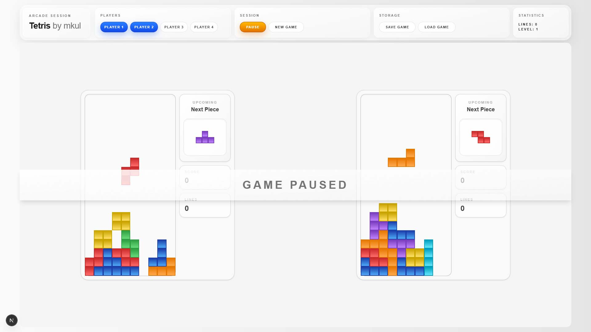

# Tetris Multiplayer (React + TypeScript)
This project is a simple multiplayer Tetris game built with React and TypeScript.

## Preview

I created it to practice working with more complex state, custom hooks, and game logic in React.

## What it does

- Supports multiple players
- Handles game state using a custom hook
- Includes scoring and level progression
- Allows saving and loading the game from localStorage
- Supports keyboard controls

## Tech stack

- React
- TypeScript
- Next.js

## How to run the project

Clone the repository and install dependencies:

```bash
npm install
npm run dev
