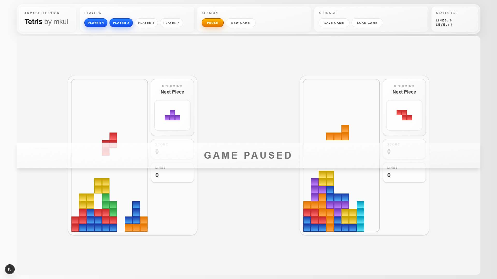

# Tetris Multiplayer (React + TypeScript)

A multiplayer Tetris game built with React, TypeScript and Next.js.

I made this project mainly to practice handling more complex state management, game logic and keyboard interactions in React without using external game engines.

## Preview



## Live Demo

https://arcade-tetris-psi.vercel.app/

---

## Features

- Up to 4 local players
- Dynamic keyboard controls for each player
- Piece rotation and collision detection
- Score and level progression system
- Save / load game using localStorage
- Pause system
- Responsive arcade-style UI
- Independent game state for every player

---

## Technical Highlights

One of the main goals of this project was separating the game logic from the UI layer.

Most of the core gameplay is handled inside a custom `useGameLogic` hook which manages:

- gravity loop
- movement handling
- collision validation
- line clearing
- scoring
- piece spawning
- keyboard bindings
- game persistence

The rendering layer is split into smaller reusable components like:

- `RenderBoard`
- `RenderNextPiece`
- `PlayerGameBoard`
- `ControlsModal`

I also used:

- `React.memo`
- `useMemo`
- `useCallback`

to reduce unnecessary re-renders during gameplay.

---

## Tech Stack

- React
- TypeScript
- Next.js
- Tailwind CSS

---

## Currently Working On

- improving game loop performance
- refactoring game state management

---

## Running Locally

Clone the repository and install dependencies:

```bash
npm install
npm run dev
